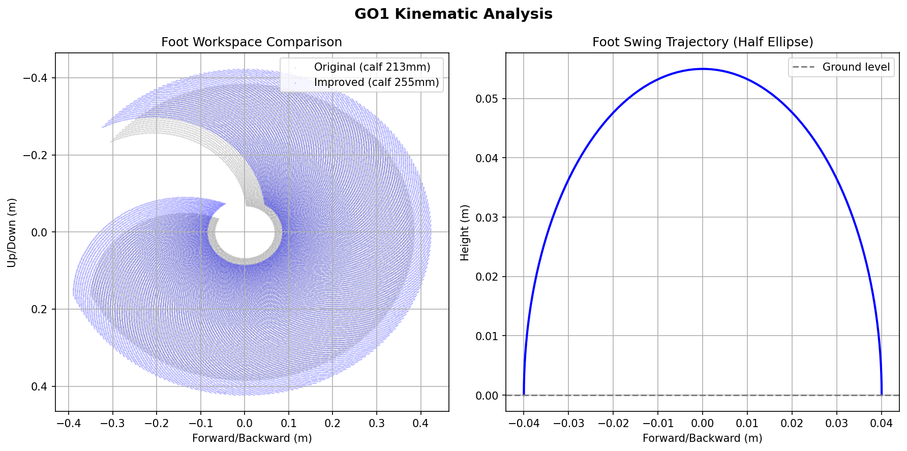

# GO1 Quadruped Locomotion Simulation


> Kinematic study and gait improvement simulation based on the Unitree Go1 —
> simulation groundwork for a future project.

---

## 1. Project Overview

QuadraBot is a self-directed kinematic study of the Unitree Go1 quadruped robot — built to understand how quadruped locomotion works from the ground up, and to explore how deliberate kinematic changes affect stability, reach, and gait quality.

The Go1 is a real research robot with conservative design choices. Conservative means safe and predictable — but it also means there is room to improve for specific use cases. This project identifies those improvements, implements them in a modified URDF, and validates them through physics simulation in PyBullet.

No physical hardware. No ROS2. Just Python, a URDF, and analytical kinematics.

QuadraBot is a locomotion research project — every gait decision and IK improvement made here gets carried forward into a future project.

---

## 2. Reference Robot — Unitree Go1

| Spec | Value |
|------|-------|
| DOF | 12 (3 per leg × 4 legs) |
| Weight | 12 kg |
| Max Speed | 3.5 m/s |
| Gait Types | Trot, Bound, Pronk |
| Leg Design | 3-link: Hip / Thigh / Calf |
| Calf Length | 213mm (original) |
| Hip Range | ±49° (original) |
| Joint Damping | 0.0 Nm·s/rad (original) |

The Go1 uses a 3-DOF leg with equal thigh and calf lengths (1:1 ratio), zero joint damping, and conservative hip range. These choices are safe for general use but leave measurable room for improvement in terrain adaptability.

---

## 3. Kinematic Improvements

5 deliberate changes from the Go1 baseline — each with engineering justification:

| # | Change | Why |
|---|--------|-----|
| 1 | Calf length 213→255mm | Longer distal segment increases foot workspace and step-over height without increasing proximal motor load. Consistent with natural quadruped biomechanics — dogs and cheetahs have a longer tibia relative to femur for exactly this reason. |
| 2 | Hip range ±49°→±60° | Wider lateral range improves stability on slopes and during turning. Keeps the robot mechanically safe while giving the controller more lateral freedom. |
| 3 | Joint damping 0→0.5/1.0/0.8 | Zero damping causes joint oscillation at gait transitions — like a door hinge with no oil. Adding damping makes motion smooth and controlled. Values tuned per joint based on load. |
| 4 | Foot radius 20→28mm | Larger contact sphere better approximates a rubber-padded foot. Increases effective contact patch and reduces slip. |
| 5 | Foot friction 0.6→0.8 | Higher friction reduces slip during stance phase on smooth surfaces, improving ground push-off efficiency. |

---

## 4. How It Works

### Inverse Kinematics

Each leg is a 3-DOF serial chain (hip, thigh, calf). Given a desired foot position in 3D space, the IK solver analytically computes the required joint angles using:
- **Pythagorean theorem** — straight-line distance from hip to foot
- **Cosine rule** — knee (calf) angle from triangle geometry
- **arctan2** — thigh angle with correct quadrant handling
- **Hip abduction** — calculated from lateral foot offset

No numerical iteration — fully closed-form solution runs at 500Hz.

### Gait Controller

Trot gait with diagonal pairs (FR+RL, FL+RR). Each leg follows a phase clock from 0→1:
- **Swing phase (0→0.5):** foot traces a half-ellipse arc through the air
- **Stance phase (0.5→1):** foot pushes backward on the ground, propelling the body forward

Phase offsets: FR+RL = 0.0, FL+RR = 0.5 — always one pair in swing, one in stance.

### System Architecture
Gait Controller (phase + timing)
↓
Foot Position (x, y, z)
↓
IK Solver (analytical 3-DOF)
↓
Joint Angle Targets (hip, thigh, calf)
↓
PyBullet Physics Sim
↓
Visual Output + Camera Follow

---

## 5. Simulation Demo

### Side-by-Side Comparison

Original Go1 parameters vs improved parameters walking simultaneously:



> 📹 [Watch Simulation Demo](https://youtu.be/W1KDJ4oqk_k)

### What the comparison shows
- **Improved robot** walks further and more stably in the same time period
- **Original robot** shows instability from zero joint damping
- Workspace plot confirms improved calf gives 19.7% larger reachable area
- Trajectory plot shows improved leg reaches 3.6cm deeper

---

## 6. How To Run

**Prerequisites**
- Python 3.8+
- Windows (tested on Windows 11)

**Install**
```bash
git clone https://github.com/manasvigudey/QuadraBot
cd QuadraBot
pip install pybullet numpy matplotlib
```

**Run simulations**
```bash
# Full walking simulation
python go1_simulation.py

# Tuned walk
python go1_tuned.py

# Original vs Improved comparison
python go1_comparison.py

# Obstacle demo
python go1_obstacle.py

# Generate analysis plots
python learning/learn_visualize.py
```

---

## 7. File Structure
```
QuadraBot/
├── go1_simulation.py          — full trot simulation (improved)
├── go1_tuned.py               — tuned gait parameters
├── go1_comparison.py          — original vs improved side by side
├── go1_obstacle.py            — obstacle navigation demo
├── go1_improved_nomesh.urdf   — improved robot (primitive shapes)
├── go1_original_nomesh.urdf   — original Go1 parameters
├── go1_improved.urdf          — improved robot (full mesh)
├── requirements.txt
│
├── learning/
│   ├── learn_ik.py            — IK solver built step by step
│   ├── learn_gait.py          — gait planner built step by step
│   ├── learn_connect.py       — IK + gait pipeline
│   ├── learn_visualize.py     — workspace + trajectory plots
│   ├── learn_pybullet.py      — PyBullet basics
│   └── learn_robot.py         — joint mapping + standing pose
│
├── config/
│   └── robot_config.py        — all robot parameters centralised
│
└── results/
├── simulation_demo.mp4    — comparison simulation video
└── workspace_comparison.png — kinematic analysis plots
```
---

## 8. What's Next 
Full obstacle clearance requires terrain-adaptive gait — planned for future work.

This simulation is the kinematic foundation for a future autonomous quadruped rescue robot project. The IK solver, gait logic, and stability improvements built here carry forward directly into that work.
